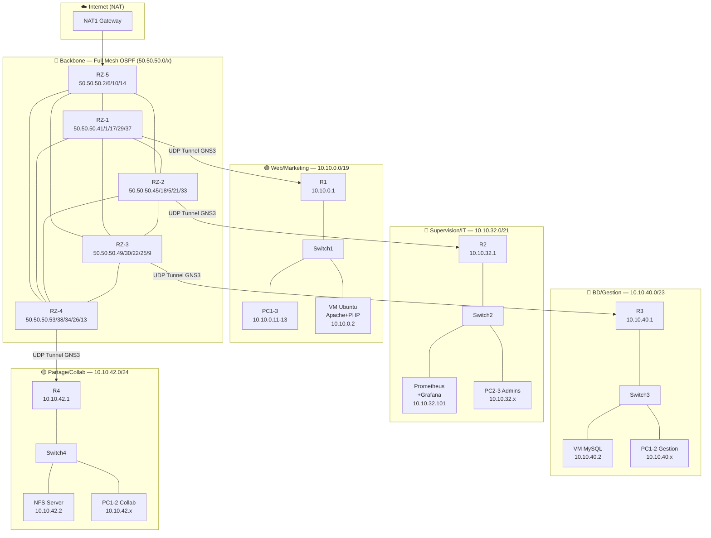
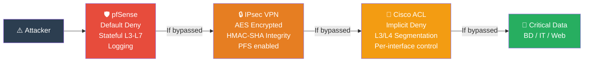

# PI-network-infrastructure
# 🌐 TechSolutions SARL — Enterprise Network Infrastructure


## 🎯 Overview

> Full-stack enterprise network deployed for **TechSolutions SARL** — a 4-department organization requiring segmented multi-service connectivity, dynamic routing, and a **3-layer Defense in Depth security architecture** (ACL · IPsec VPN · pfSense). Every design decision is documented, justified, and reproducible.

46-page technical documentation covers architecture, full configurations, security matrices, troubleshooting runbooks, and validation test results.

---

## 📋 Table of Contents

- [Architecture](#-architecture)
- [Tech Stack](#-tech-stack)
- [Security Stack](#-security-stack)
  - [ACL — Stateless Filtering](#layer-1--acl-cisco--stateless-filtering-l3l4)
  - [VPN IPsec — Site-to-Site](#layer-2--vpn-ipsec--site-to-site-encryption)
  - [Firewall pfSense — Stateful Inspection](#layer-3--firewall-pfsense--stateful-inspection)
  - [Defense in Depth Synthesis](#defense-in-depth-synthesis)
- [Screenshots](#-screenshots)
- [Reproduction Guide](#-reproduction-guide)
- [Tests & Validation](#-tests--validation)
- [License](#-license)

---

## 🏗️ Architecture

### Physical / Logical Topology



### IP Addressing Plan (VLSM)

| Subnet | Mask | Network | Range | Role |
|--------|------|---------|-------|------|
| SR1 Web/Marketing | /19 | 10.10.0.0 | .1 – .31.254 | 6810 hosts |
| SR2 Supervision/IT | /21 | 10.10.32.0 | .1 – .39.254 | 1270 hosts |
| SR3 BD/Gestion | /23 | 10.10.40.0 | .1 – .41.254 | 424 hosts |
| SR4 Partage/Collab | /24 | 10.10.42.0 | .1 – .42.254 | 192 hosts |
| SR5–SR14 Backbone | /30 | 50.50.50.0+ | — | Point-to-point links |
| SR15–SR18 Access | /30 | 50.50.50.40+ | — | RZ-x ↔ R-x links |

---

## 🔧 Tech Stack

| Technology | Role | Justification |
|------------|------|---------------|
| **Cisco IOS Routers** | Routing, ACL, VPN endpoints | Industry standard, native IPsec/OSPF/DHCP support |
| **OSPF Area 0** | Dynamic routing on backbone | SPF convergence, automatic failover, cost-based load balancing |
| **VLSM** | IP address allocation | Eliminates waste — subnets sized to actual host count |
| **DHCP (IOS)** | Dynamic addressing per LAN | Centralized on R1-R4, reduces admin overhead |
| **NAT/PAT (RZ-5)** | Internet access gateway | Single controlled egress point, centralized logging |
| **GNS3** | Network simulation | Real IOS images in virtualized topology — production-equivalent behavior |
| **VMware VMnet2** | VM-to-GNS3 integration | Host-only isolated network bridged into GNS3 via Cloud nodes |
| **Ubuntu Server** | Web/DB/NFS/Monitoring VMs | Lightweight, apt ecosystem, Netplan network config |
| **Apache + PHP** | Web server | Dynamic content with MySQL backend |
| **MySQL** | Relational database | Employee data, web app backend |
| **NFS (kernel)** | File sharing | Native Linux protocol, low overhead |
| **Prometheus + Grafana** | Infrastructure monitoring | Time-series metrics, alert rules, visual dashboards |
| **pfSense** | Perimeter firewall | Stateful inspection, Default Deny, multi-interface zone enforcement |

---

## 🛡️ Security Stack

This infrastructure implements a **3-layer Defense in Depth** model. Each layer independently protects against a distinct threat vector. Bypassing one layer does not grant access — the attacker still faces the remaining two.

```
┌──────────────────────────────────────────────────────────────┐
│  🌐 Internet / Untrusted                                     │
│         ↓                                                    │
│  ┌──────────────────────────────────────────────────────┐    │
│  │ 🛡️ LAYER 3 — pfSense Stateful Firewall              │    │
│  │   Default Deny · Zone enforcement · L3-L7 inspect   │    │
│  │                                                      │    │
│  │  ┌────────────────────────────────────────────────┐  │    │
│  │  │ 🔒 LAYER 2 — IPsec VPN Site-to-Site           │  │    │
│  │  │   AES encryption · HMAC-SHA integrity         │  │    │
│  │  │   IKE Phase1+2 · Perfect Forward Secrecy      │  │    │
│  │  │                                               │  │    │
│  │  │  ┌───────────────────────────────────────┐    │  │    │
│  │  │  │ 🔑 LAYER 1 — Cisco ACL               │    │  │    │
│  │  │  │   Stateless L3/L4 · Implicit deny    │    │  │    │
│  │  │  │   Inter-VLAN segmentation            │    │  │    │
│  │  │  │                                      │    │  │    │
│  │  │  │  🏢 CRITICAL ZONES                   │    │  │    │
│  │  │  │  BD/Gestion · Supervision/IT         │    │  │    │
│  │  │  └───────────────────────────────────────┘    │  │    │
│  │  └────────────────────────────────────────────────┘  │    │
│  └──────────────────────────────────────────────────────┘    │
└──────────────────────────────────────────────────────────────┘
```

---

### Layer 1 — ACL Cisco : Stateless Filtering L3/L4

ACLs are deployed on access routers R1–R4 to enforce inter-department segmentation and protect critical interfaces.

**Key principle: Implicit Deny** — every ACL ends with an invisible `deny any any`. Anything not explicitly permitted is silently dropped.

**Traffic Flow Matrix:**

| Source | Destination | Service | Action | Security Rationale |
|--------|-------------|---------|--------|-------------------|
| Web LAN `10.10.0.0/19` | `192.168.0.1` | TCP 80/443 | PERMIT | Core business flow — web publishing |
| IT LAN `10.10.32.0/21` | Any | TCP 22 | PERMIT | Admin SSH — only IT zone allowed |
| Any | BD LAN `10.10.40.0/23` | TCP 3306 | DENY | Direct MySQL blocked — app server only |
| Collab `10.10.44.0/24` | Web LAN | ANY | DENY | No cross-zone access without backbone |
| BD LAN `10.10.40.0/23` | `192.168.40.1` | TCP 21 | PERMIT | Controlled FTP transfers within zone |

**Configuration excerpt (R3 — BD/Gestion protection):**

```cisco
ip access-list extended PROTECT_BD
  ! Allow MySQL ONLY from the web application server
  permit tcp host 10.10.0.2 10.10.40.0 0.0.1.255 eq 3306

  ! Allow SSH administration from IT zone only
  permit tcp 10.10.32.0 0.0.7.255 10.10.40.0 0.0.1.255 eq 22

  ! Allow Prometheus scraping from monitoring server
  permit tcp host 10.10.32.101 10.10.40.0 0.0.1.255 eq 9100

  ! Implicit deny — all other traffic silently dropped
  ! deny ip any any  ← not visible, always active

interface FastEthernet0/1
  ip access-group PROTECT_BD in
```

---

### Layer 2 — VPN IPsec : Site-to-Site Encryption

IPsec tunnels protect inter-site traffic traversing the public backbone. IKE Phase 1 establishes the secure control channel; Phase 2 negotiates the data protection SAs.

**Tunnel topology:**

```mermaid
sequenceDiagram
    participant R1 as R1 (Web Site)<br/>50.50.50.41
    participant BB as Backbone OSPF<br/>50.50.50.0/x
    participant R3 as R3 (BD Site)<br/>50.50.50.49

    Note over R1,R3: IKE Phase 1 — ISAKMP SA negotiation
    R1->>R3: ISAKMP Proposal (AES, SHA, DH-group2)
    R3->>R1: ISAKMP Accept
    R1->>R3: DH Key Exchange
    R3->>R1: DH Key Exchange
    R1->>R3: Authentication (pre-shared key)
    R3->>R1: Authentication OK
    Note over R1,R3: ISAKMP SA established ✅

    Note over R1,R3: IKE Phase 2 — IPsec SA negotiation
    R1->>R3: IPsec Proposal (ESP-AES, ESP-SHA-HMAC)
    R3->>R1: IPsec Accept
    Note over R1,R3: IPsec SAs established (bidirectional) ✅

    Note over R1,BB,R3: Data flows encrypted through tunnel
    R1->>BB: [ESP] Encrypted payload (AES)
    BB->>R3: [ESP] Encrypted payload (AES)
    R3->>R1: [ESP] Encrypted response
```

**Full configuration (R1 side):**

```cisco
! Phase 1 — ISAKMP Policy
crypto isakmp policy 10
  encryption aes
  hash sha
  authentication pre-share
  group 2
  lifetime 86400

! Pre-shared key for peer R3
crypto isakmp key TechSol$VPN2024 address 50.50.50.49

! Phase 2 — Transform-Set
crypto ipsec transform-set TS_TECHSOL esp-aes esp-sha-hmac

! Interesting traffic (what goes into the tunnel)
ip access-list extended CRYPTO_R1_R3
  permit ip 10.10.0.0 0.0.31.255 10.10.40.0 0.0.1.255

! Crypto map — ties peer, transform-set, and ACL
crypto map CM_TECHSOL 10 ipsec-isakmp
  set peer 50.50.50.49
  set transform-set TS_TECHSOL
  match address CRYPTO_R1_R3
  set pfs group2

! Apply to WAN interface
interface FastEthernet0/0
  crypto map CM_TECHSOL
```

**Why IPsec over alternatives:**

| Option | Decision | Reason |
|--------|----------|--------|
| IPsec Site-to-Site | ✅ **Selected** | Native IOS support, strong cryptography, router-to-router optimized |
| SSL VPN | ❌ Rejected | User-oriented, not suited for router-to-router permanent tunnels |
| GRE (bare) | ❌ Rejected | No encryption — data in cleartext on backbone |
| MPLS VPN | ❌ Rejected | Requires carrier infrastructure, out of scope |

---

### Layer 3 — Firewall pfSense : Stateful Inspection

pfSense is deployed at the perimeter between the backbone and sensitive zones, providing stateful inspection with Default Deny policy.

**Zone architecture:**

| Interface | Zone | Network | Trust Level |
|-----------|------|---------|-------------|
| `em0` WAN | Untrusted | 50.50.50.x | 0 — Block all inbound |
| `em1` LAN | Trusted | 10.10.32.0/21 | 3 — IT Admin |
| `em2` DMZ | Semi-trusted | 10.10.0.0/19 | 1 — Web services |
| `em3` BD | Critical | 10.10.40.0/23 | 2 — Restricted |

**Firewall rules:**

| # | Direction | Source | Destination | Port | Action | Log | Note |
|---|-----------|--------|-------------|------|--------|-----|------|
| 1 | WAN → ANY | ANY | ANY | ALL | **BLOCK** | ✅ | Default deny — no inbound from Internet |
| 2 | LAN → WAN | IT `10.10.32.0/21` | ANY | TCP 443 | **PASS** | ✅ | HTTPS for admins only |
| 3 | LAN → WAN | IT `10.10.32.0/21` | ANY | TCP 22 | **PASS** | ✅ | SSH outbound for remote management |
| 4 | DMZ → BD | `10.10.0.2` (web srv) | `10.10.40.2` | TCP 3306 | **PASS** | ✅ | Only web server → MySQL allowed |
| 5 | DMZ → BD | ANY (not web srv) | `10.10.40.0/23` | TCP 3306 | **BLOCK** | ✅ | Block all other MySQL access |
| 6 | LAN → BD | IT `10.10.32.0/21` | `10.10.40.0/23` | TCP 22 | **PASS** | ✅ | Admin SSH to DB servers |
| 7 | DMZ → LAN | ANY | `10.10.32.0/21` | ALL | **BLOCK** | ✅ | Web zone cannot reach IT network |
| 9 | ANY | ANY | ANY | ALL | **BLOCK** | ✅ | Catch-all explicit deny with logging |

**ACL vs pfSense — key distinction:**

| | Cisco ACL | pfSense |
|---|---|---|
| State model | **Stateless** — each packet independent | **Stateful** — session table maintained |
| OSI layers | L3/L4 | L3 to **L7** |
| Return traffic | Must be explicitly permitted | **Auto-allowed** for established sessions |
| Attack detection | Limited | SYN flood, port scan, malformed fragments |
| Best for | Fast inter-VLAN segmentation | Perimeter control, DMZ enforcement |

---

### Defense in Depth Synthesis



An attacker who breaches Layer 3 (pfSense) faces encrypted data at Layer 2 (IPsec). If somehow positioned on the backbone, Layer 1 ACLs enforce source/destination restrictions at the router level. **Three independent barriers — each one alone is insufficient; together they are resilient.**

---

## 📸 Screenshots

| # | Screenshot | Description |
|---|-----------|-------------|
| 1 | `fig_1_1_topology_gns3.png` | Full GNS3 topology — 4 departments, backbone, NAT node visible |
| 2 | `fig_1_2_backbone.png` | Backbone full-mesh — 5 routers, OSPF adjacencies established |
| 3 | `fig_1_4_rz1_interfaces.png` | `show ip int brief` on RZ-1 — all backbone interfaces UP/UP |
| 4 | `fig_2_7_yaml_web.png` | Ubuntu Netplan YAML config for Web VM — static IP, gateway, DNS |
| 5 | `fig_2_9_ping_web.png` | Ping test from Web VM to router gateway — 0% packet loss |
| 6 | `fig_2_16_prometheus.png` | Prometheus targets — 5/5 node exporters UP across all departments |
| 7 | `fig_2_17_grafana.png` | Grafana dashboard — CPU, memory, I/O gauges for all VMs |
| 8 | `fig_2_27_web_db.png` | TechSolutions SARL web app displaying MySQL employee data live |
| 9 | `fig_acl_config.png` | `show ip access-lists` — ACL hit counts confirming rules are active |
| 10 | `fig_ipsec_sa.png` | `show crypto ipsec sa` — encaps/decaps counters > 0 (tunnel active) |
| 11 | `fig_pfsense_rules.png` | pfSense WebGUI — firewall rules table with logging enabled |

---

## 🚀 Reproduction Guide

### Prerequisites

- GNS3 2.2+ with Cisco IOS images (c7200 or c3725)
- VMware Workstation Pro (VMnet2 configured as Host-Only `192.168.15.0/24`)
- 5 physical machines (or 1 high-spec machine with 5 GNS3 projects linked via UDP tunnels)
- pfSense ISO for VM deployment

### Step 1 — Build the Backbone

```bash
# On Machine 1 — Backbone project
# Create GNS3 project with RZ-1 to RZ-5 + NAT1
# Configure interfaces per VLSM table SR5-SR14
# Enable OSPF Area 0 on all backbone routers
```

```cisco
! Example: RZ-1 base configuration
hostname RZ-1
!
interface Serial0/0
  ip address 50.50.50.1 255.255.255.252
  no shutdown
!
router ospf 1
  router-id 1.1.1.1
  network 50.50.50.0 0.0.0.255 area 0
```

### Step 2 — Configure Department Zones

```cisco
! R1 (Web/Marketing) — key configuration
hostname R1
!
interface FastEthernet0/0
  ip address 50.50.50.41 255.255.255.252  ! Backbone link
  no shutdown
!
interface FastEthernet0/1
  ip address 10.10.0.1 255.255.224.0      ! LAN Web/Marketing
  ip helper-address 10.10.0.1             ! DHCP relay (self)
  no shutdown
!
! DHCP pool for Web/Marketing department
ip dhcp pool WEB_MARKETING
  network 10.10.0.0 255.255.224.0
  default-router 10.10.0.1
  dns-server 8.8.8.8 8.8.4.4
  lease 7
!
router ospf 1
  router-id 10.1.1.1
  network 50.50.50.40 0.0.0.3 area 0
  network 10.10.0.0 0.0.31.255 area 0
```

### Step 3 — Deploy VM Services

```bash
# Web service VM (Ubuntu 22.04)
# 1. Install Apache + PHP + MySQL client
sudo apt update && sudo apt install -y apache2 php libapache2-mod-php php-mysql

# 2. Configure Netplan (static IP)
sudo nano /etc/netplan/01-netcfg.yaml
# Set: addresses [10.10.0.2/19], gateway4: 10.10.0.1

# 3. Deploy web app
sudo cp -r ./webApp /var/www/html/
sudo systemctl restart apache2
```

```bash
# Monitoring VM (Prometheus + Grafana)
# Auto-install via provided shell script
chmod +x monitoring_setup.sh
sudo ./monitoring_setup.sh
# Accès Grafana: http://10.10.32.101:3000 (admin/admin)
```

### Step 4 — Apply Security Layers

```cisco
! Layer 1: Apply ACLs on department routers
! See Section 5.1 for full configurations

! Layer 2: Configure IPsec VPN
! See Section 5.2 for full R1-R3 tunnel configuration

! Layer 3: pfSense — deploy VM, configure zones
! Import rules from pfsense_rules_backup.xml
```

### Step 5 — Verify End-to-End Connectivity

```bash
# From Web VM — test backbone reachability
ping 10.10.40.1    # R3 gateway (BD zone)
ping 10.10.32.1    # R2 gateway (IT zone)

# From any VPCS
> ip dhcp           # Get dynamic address
> ping 10.10.0.1    # Gateway reachability
> ping 8.8.8.8      # Internet via NAT
```

---

## 📊 Tests & Validation

### Connectivity Tests

| Test | Command | Expected Result | Status |
|------|---------|-----------------|--------|
| LAN gateway reachability | `ping 10.10.0.1` | 0% loss, <2ms | ✅ |
| Inter-department routing | `ping 10.10.40.1` from Web | 0% loss via backbone | ✅ |
| DHCP address assignment | `ip dhcp` on VPCS | DORA sequence, IP assigned | ✅ |
| Internet access via NAT | `ping 8.8.8.8` | 0% loss | ✅ |
| Web app accessibility | `curl http://10.10.0.2/` | HTML response from Apache | ✅ |
| NFS mount | `mount -t nfs 10.10.42.2:/srv/nfs/partage /mnt` | Successful mount | ✅ |

### Routing Validation

```cisco
! Verify OSPF adjacencies
show ip ospf neighbor
! Expected: all backbone routers in FULL state

! Verify OSPF routing table
show ip route ospf
! Expected: O routes for all 18 subnets

! Verify specific path
show ip route 10.10.40.0
! Expected: OSPF route via backbone with correct next-hop
```

### Security Validation

```cisco
! ACL hit counters
show ip access-lists
! Verify: match counts increment on deny rules when blocked traffic attempted

! VPN tunnel state
show crypto isakmp sa
! Expected: QM_IDLE (Phase 1 active)

show crypto ipsec sa
! Expected: pkts encaps > 0 AND pkts decaps > 0 (bidirectional traffic confirmed)
! Critical: pkts invalid/no sa should be 0

! VPN debug (maintenance only)
debug crypto isakmp
debug crypto ipsec
```

### Monitoring Validation

```bash
# Prometheus targets health
curl http://10.10.32.101:9090/api/v1/targets | python3 -m json.tool
# Expected: all targets "state": "up"

# Node exporter metrics
curl http://10.10.0.2:9100/metrics | grep node_cpu
# Expected: CPU metrics for web server
```

---

## 📝 License

```
MIT License

Copyright (c) 2024 TechSolutions SARL Network Project — ESPRIT 3A33

Permission is hereby granted, free of charge, to any person obtaining a copy
of this software and associated documentation files (the "Software"), to deal
in the Software without restriction, including without limitation the rights
to use, copy, modify, merge, publish, distribute, sublicense, and/or sell
copies of the Software.
```

---

## 🤝 Contributing

Issues, improvements, and additional security layer implementations are welcome. Open a PR with:
- Clear description of the change
- Updated configuration snippets (use `cisco` or `bash` code fences)
- Test validation results

For questions on the architecture or reproductibility issues, open a GitHub Discussion.

---

*Built at ESPRIT — École Supérieure Privée d'Ingénierie et de Technologies, Tunisia · Class 3A33*
